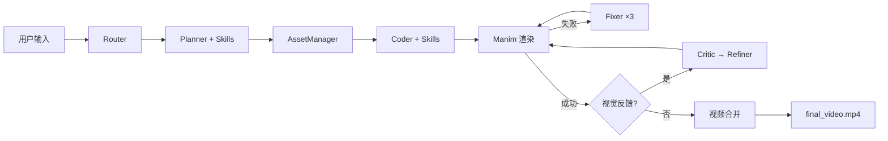

# MathVideo: AI 数学视频生成器

**中文** | [🇬🇧 English](README_en.md)

利用大语言模型 (Claude Opus 4.5) + Manim 动画引擎，自动将数学题目/知识点转化为讲解视频的端到端系统。

支持 **CLI / Web / Tauri 桌面端** 三种使用模式。


## ✨ 核心特性

- **🔀 智能路由**: Router Agent 自动识别任务类型（知识点 / 几何 / 应用题 / 证明），选择最优生成策略
- **🤖 智能规划**: Planner Agent 将数学主题拆解为结构化分镜脚本，支持独立/递进两种 Section 模式
- **🎬 代码生成**: Coder Agent 自动生成 Manim Python 动画代码，递进模式下自动继承前序图形
- **🔧 自动修复**: 渲染失败时 Fixer Agent 分析错误并修复代码（最多重试 3 次）
- **👁️ 视觉反馈**: Visual Critic 使用 Gemini 3 Pro 视觉模型分析渲染帧，检测布局/几何问题
- **✨ 智能优化**: Refiner Agent 根据视觉反馈自动调整视觉参数
- **🖼️ 资产管理**: AssetManager 自动识别所需图标并下载/生成 SVG
- **📐 Skill 注入**: 按任务类型加载经验技巧文件，持续提升生成质量
- **🖥️ 多平台**: Web 界面 + Tauri 桌面端 + CLI，三种使用方式

## 📋 环境要求

- **Python** 3.10+（推荐 `.venv` 虚拟环境 或 Conda 环境）
- **FFmpeg**（Manim 视频合成必需）
- **LaTeX**（可选，有完善的回退机制）

> **关于 LaTeX**: 系统内置了完整的 LaTeX 回退机制——当 `pdflatex` 不可用时，`MathTex` 会被自动替换为功能对等的 `Text` 子类，支持 `\frac{}{}`、`\sqrt{}`、上下标、希腊字母等常见数学符号的结构化解析渲染。即使不安装 LaTeX 也能正常运行。如需最佳公式效果，建议安装 [MiKTeX](https://miktex.org/) (Windows) / [MacTeX](https://www.tug.org/mactex/) (macOS) / `texlive-full` (Linux)。

## 🚀 快速开始

### 方式一：venv 虚拟环境（推荐）

```bash
# 创建虚拟环境
python -m venv .venv

# 激活（Windows）
.venv\Scripts\activate
# 激活（macOS / Linux）
source .venv/bin/activate

# 安装依赖（含 manim）
pip install -r requirements.txt

# 系统级安装 ffmpeg（Manim 必需）
# Windows: winget install ffmpeg  /  choco install ffmpeg
# macOS:   brew install ffmpeg
# Linux:   sudo apt install ffmpeg
```

### 方式二：Conda 环境

```bash
conda create -n mathvideo python=3.10 -y
conda activate mathvideo
conda install -c conda-forge manim ffmpeg -y
pip install -r requirements.txt
```

### 配置 API 密钥

在项目根目录创建 `.env` 文件：

```dotenv
# 必填 — Claude API（规划 / 代码生成 / 修复）
CLAUDE_API_KEY=sk-ant-your-key-here
CLAUDE_MODEL_NAME=claude-opus-4-5-20251101

# 可选 — Gemini API（视觉反馈 + 图片理解）
GEMINI_API_KEY=AIza-your-key-here
GEMINI_VISION_MODEL_NAME=gemini-3-pro-preview

# 可选 — 图标下载
ICONFINDER_API_KEY=your-key-here

# 可选 — 功能开关
USE_VISUAL_FEEDBACK=true    # 启用 Critic→Refiner 视觉反馈循环
USE_ASSETS=true             # 启用 AssetManager 图标增强
```

## 📖 使用方法

### CLI 模式

```bash
# 生成并渲染视频
python -m mathvideo "勾股定理的证明" --render

# 仅生成代码（不渲染）
python -m mathvideo "二次方程求根公式"

# 多模态输入（文本 + 图片）
python -m mathvideo "求图中三角形的面积" --image ./triangle.png --render

# 指定输出目录
python -m mathvideo "正弦定理" --render --output-dir ./output/my-project

# 兼容旧入口
python main.py "勾股定理" --render
```

### Web 界面

```bash
# 方式一：使用启动脚本
.\start-dev.ps1          # Windows PowerShell
./start-dev.sh            # macOS / Linux

# 方式二：手动启动（两个终端）
# 终端 1 — 后端 (端口 8000)
python -m uvicorn backend.main:app --host 0.0.0.0 --port 8000

# 终端 2 — 前端 (端口 3000)
cd frontend && npm install && npm run dev
```

- 前端界面: http://localhost:3000
- API 文档 (Swagger): http://localhost:8000/docs
- 健康检查: http://localhost:8000/health

### Tauri 桌面端

```bash
cd frontend
npm run tauri:dev      # 开发
npm run tauri:build    # 打包 .msi / .dmg
```

### 输出结构

```
output/<slug>/                     # 如: 勾股定理的证明-a3f1b2
├── storyboard.json                # 分镜脚本（含 task_type, sections）
├── inputs/                        # 用户上传图片副本
├── assets/                        # SVG 图标（AssetManager）
├── scripts/                       # Manim Python 脚本
│   ├── section_1.py
│   ├── section_2.py
│   └── section_3.py
├── media/videos/                  # Manim 渲染的分段 MP4
│   ├── section_1/480p15/Section1Scene.mp4
│   └── ...
└── final_video.mp4                # 合并后的完整讲解视频
```

## 🏗️ 系统架构

### Pipeline

```
用户输入 → Router → Planner → AssetManager → Coder → Manim渲染 → [Fixer] → [Critic] → [Refiner] → 视频合并
```

### Agent 体系

| Agent | 文件 | 模型 | 职责 |
|-------|------|------|------|
| **Router** | `mathvideo/agents/router.py` | Claude (temp=0.1) | 分类任务类型（knowledge / geometry / problem / proof） |
| **Planner** | `mathvideo/agents/planner.py` | Claude (temp=0.7) | 按任务类型选择 Prompt，生成 `storyboard.json` |
| **AssetManager** | `mathvideo/agents/asset_manager.py` | Claude (temp=0.3) | 分析图标需求，下载/生成 SVG |
| **Coder** | `mathvideo/agents/coder.py` | Claude (temp=0.5) | 按 Section 模式生成 Manim 代码 |
| **Fixer** | `mathvideo/agents/coder.py` | Claude (temp=0.2) | 分析渲染错误，修复代码（最多 3 次） |
| **Critic** | `mathvideo/agents/critic.py` | Gemini 3 Pro → Claude 回退 | 提取视频帧 → 视觉模型分析布局/几何正确性 |
| **Refiner** | `mathvideo/agents/coder.py` | Claude (temp=0.3) | 根据 Critic 反馈调整视觉参数 |
| **SkillManager** | `mathvideo/agents/skill_manager.py` | — | 按任务类型加载经验技巧注入 Prompt |

### 任务类型与 Section 模式

| 任务类型 | Section 模式 | Planner Prompt | Coder Prompt | 说明 |
|----------|-------------|----------------|--------------|------|
| `knowledge` | 独立模式 | `PLANNER_PROMPT` | `CODER_PROMPT` | 知识点讲解，各 Section 互不依赖 |
| `problem` | 独立模式 | `PLANNER_PROMPT` | `CODER_PROMPT` | 应用/计算题 |
| `geometry` | **递进模式** | `PLANNER_GEOMETRY_PROMPT` | `CODER_SEQUENTIAL_PROMPT` | 几何构造，Section 间传递构图上下文 |
| `proof` | **递进模式** | `PLANNER_PROOF_PROMPT` | `CODER_SEQUENTIAL_PROMPT` | 证明推导，逐步连贯 |

**递进模式**: Planner 为每个 Section 标注 `inherited_objects`/`new_objects`，Coder 先 `self.add()` 静默重建继承对象，再动画展示新对象。

### 流程图



### 支撑模块

| 模块 | 文件 | 说明 |
|------|------|------|
| **TeachingScene** | `mathvideo/manim_base.py` | Manim 基类：布局系统、10×10 网格定位、颜色别名、LaTeX 回退、LLM 兼容补丁 |
| **ClaudeDirectChat** | `mathvideo/llm_client.py` | LangChain `BaseChatModel` 子类，直接用 `requests` 调 Anthropic API |
| **GeminiNative** | `mathvideo/gemini_native.py` | Gemini 原生 `generateContent` API 封装（图片理解 + 视觉分析） |
| **Prompts** | `mathvideo/agents/prompts.py` | 所有 LLM Prompt 模板集中管理 |
| **Config** | `mathvideo/config.py` | 环境变量配置，功能开关 |

## 🎯 TeachingScene 网格系统

所有生成的 Manim 脚本继承自 `TeachingScene`，使用统一的布局框架：

```
┌─────────────────────────┬──────────────────────────────┐
│ 标题                     │  A1  A2  A3  ...  A10       │
│ ─────────────            │  B1  B2  B3  ...  B10       │
│ • 讲义笔记 1              │  C1  C2  C3  ...  C10       │
│ • 讲义笔记 2              │  ...                        │
│ • 讲义笔记 3              │  J1  J2  J3  ...  J10       │
│                          │                             │
│   左侧 (讲义区)           │    右侧 (动画区 10×10 网格)   │
└─────────────────────────┴──────────────────────────────┘
```

```python
from mathvideo.manim_base import TeachingScene
from manim import *

class Section1Scene(TeachingScene):
    def construct(self):
        self.setup_layout("标题", ["笔记1", "笔记2"])
        
        self.highlight_line(0)                          # 高亮讲义行
        circle = Circle(color=BLUE)
        self.place_in_area(circle, 'B2', 'H8')         # 区域定位
        self.play(Create(circle))
        
        label = self.add_side_label(polygon, 0, "a")    # 边标签
        mark = self.add_right_angle_mark(polygon, 1)    # 直角标记
```

## 📐 Skill 注入系统

按任务类型自动加载经验技巧文件，追加到 Planner 和 Coder 的 Prompt 末尾：

```
mathvideo/skills/
├── common/           ← 所有类型共用（网格定位、标签、视觉一致性）
├── geometry/         ← 几何题（三角形构造、角平分线、对称、中点延长）
├── knowledge/        ← 知识点讲解（待扩充）
├── problem/          ← 应用题（待扩充）
└── proof/            ← 证明题（等式链、推理箭头）
```

扩展方式：在对应目录下新建 `.md` 文件即可自动生效，无需修改代码。

## 🌐 Web 架构

```
┌─────────────────┐  rewrites  ┌──────────────────┐  subprocess  ┌──────────────┐
│   Next.js 前端   │──────────→│   FastAPI 后端    │────────────→│ mathvideo CLI │
│   (端口 3000)    │   /api/*  │   (端口 8000)     │  exec (无shell)│  (Pipeline)  │
│                 │◄──────────│                   │◄────────────│              │
│  • 生成表单      │  WebSocket │  • REST API       │   stdout     │  • Router    │
│  • 实时日志      │  日志推送   │  • 静态文件 /static│   日志流      │  • Planner   │
│  • 视频播放      │           │  • WebSocket 广播  │             │  • Coder     │
│  • 分镜编辑      │           │                   │             │  • Manim     │
└─────────────────┘           └──────────────────┘             └──────────────┘
```

- **子进程安全**: 后端使用 `create_subprocess_exec()` 直接传递参数列表，避免 shell 解析特殊字符（`$`、`>`、`^`、`()` 等数学符号）
- **WebSocket 实时日志**: `ws://localhost:8000/api/generate/ws/{task_id}`，30 秒心跳保活
- **静态文件服务**: 后端挂载 `output/` 目录为 `/static/` 路径
- **Tauri 桌面端**: WebView 加载 Next.js，Rust 侧管理 FastAPI 进程生命周期

## 🔧 配置选项

| 配置项 | 说明 | 默认值 |
|--------|------|--------|
| `CLAUDE_API_KEY` | Claude API 密钥 | **必填** |
| `CLAUDE_MODEL_NAME` | Claude 模型 | `claude-opus-4-5-20251101` |
| `GEMINI_API_KEY` | Gemini API 密钥（启用视觉反馈+图片理解） | 可选 |
| `GEMINI_VISION_MODEL_NAME` | Gemini 视觉模型 | `gemini-3-pro-preview` |
| `ICONFINDER_API_KEY` | IconFinder 密钥（启用真实图标下载） | 可选 |
| `USE_VISUAL_FEEDBACK` | 启用 Critic→Refiner 视觉反馈循环 | `true` |
| `USE_ASSETS` | 启用 AssetManager 图标增强 | `true` |

## 📁 项目结构

```
code2video/
├── mathvideo/                    # 核心 Python 包
│   ├── cli.py                    # CLI 入口 + 主流程编排
│   ├── manim_base.py             # TeachingScene 基类（1000+ 行）
│   ├── llm_client.py             # Claude API 封装
│   ├── gemini_native.py          # Gemini 原生 API 封装
│   ├── config.py                 # 配置管理
│   ├── utils.py                  # Slug 生成、目录重命名
│   ├── agents/                   # Agent 模块
│   │   ├── router.py             # 任务类型路由
│   │   ├── planner.py            # 分镜规划
│   │   ├── coder.py              # 代码生成 / 修复 / 优化
│   │   ├── critic.py             # 视觉分析
│   │   ├── asset_manager.py      # 资产管理
│   │   ├── skill_manager.py      # 技能加载器
│   │   └── prompts.py            # 所有 Prompt 模板
│   └── skills/                   # 经验技巧文件
│       ├── common/               # 通用技巧
│       ├── geometry/             # 几何专用
│       ├── knowledge/            # 知识点专用
│       ├── problem/              # 应用题专用
│       └── proof/                # 证明专用
├── backend/                      # FastAPI Web 后端
│   ├── main.py                   # 应用入口 + 中间件
│   └── api/                      # 路由模块
│       ├── generate.py           # 生成任务 + WebSocket
│       ├── projects.py           # 项目 CRUD
│       └── refiner.py            # 手动视觉优化
├── frontend/                     # Next.js 前端
│   ├── app/                      # App Router 页面
│   ├── components/               # React 组件
│   ├── lib/                      # API 客户端 + 类型定义
│   └── src-tauri/                # Tauri 桌面端 (Rust)
├── output/                       # 项目输出目录（运行时生成）
├── docs/                         # 详细文档
│   ├── ARCHITECTURE.md           # 系统架构详解
│   ├── BACKEND.md                # 后端 API + Agent 详解
│   ├── FRONTEND.md               # 前端组件 + 设计系统
│   ├── DEPLOYMENT.md             # 部署指南
│   └── CHANGELOG.md              # 变更日志
└── test_input/                   # 测试输入示例
```

## 📚 详细文档

| 文档 | 内容 |
|------|------|
| [系统架构](docs/ARCHITECTURE.md) | 完整流程图、各阶段详解、Skill 系统、网格定位系统 |
| [后端详解](docs/BACKEND.md) | Agent 实现细节、API 路由、WebSocket 协议、CLI 主流程 |
| [前端指南](docs/FRONTEND.md) | 组件说明、设计系统、Tauri 集成、API 层 |
| [部署指南](docs/DEPLOYMENT.md) | CLI / Web / Tauri 三种部署方式、CI/CD |
| [变更日志](docs/CHANGELOG.md) | 版本历史和重要变更记录 |

## 📄 License

MIT License