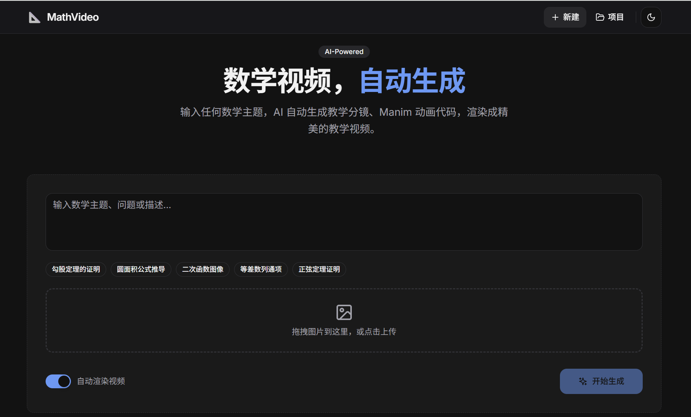
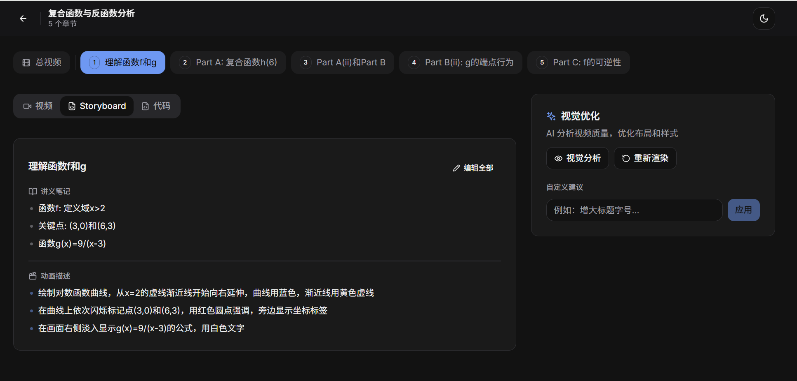
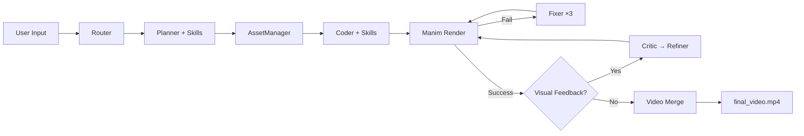

# MathVideo: AI Math Video Generator

[🇨🇳 中文](README.md) | **English**

An end-to-end system that automatically generates math tutorial videos from topics/problems using LLMs (Claude Opus 4.5) + Manim animation engine.

Supports **CLI / Web / Tauri Desktop** — three deployment modes.





## ✨ Key Features

- **🔀 Smart Routing**: Router Agent automatically identifies task types (knowledge / geometry / word problems / proofs) and selects the optimal generation strategy
- **🤖 Intelligent Planning**: Planner Agent decomposes math topics into structured storyboard scripts, supporting both independent and sequential section modes
- **🎬 Code Generation**: Coder Agent automatically generates Manim Python animation code; sequential mode inherits geometry from previous sections
- **🔧 Auto-Fix**: Fixer Agent analyzes errors and repairs code when rendering fails (up to 3 retries)
- **👁️ Visual Feedback**: Visual Critic uses Gemini 3 Pro vision model to analyze rendered frames, detecting layout/geometry issues
- **✨ Smart Refinement**: Refiner Agent automatically adjusts visual parameters based on critic feedback
- **🖼️ Asset Management**: AssetManager automatically identifies required icons and downloads/generates SVGs
- **📐 Skill Injection**: Loads experience/tip files by task type to continuously improve generation quality
- **🖥️ Multi-Platform**: Web UI + Tauri desktop + CLI — three ways to use

## 📋 Requirements

- **Python** 3.10+ (`.venv` virtual environment or Conda recommended)
- **FFmpeg** (required by Manim for video compositing)
- **LaTeX** (optional — robust fallback mechanism included)

> **About LaTeX**: The system includes a comprehensive LaTeX fallback — when `pdflatex` is unavailable, `MathTex` is automatically replaced with a functionally equivalent `Text` subclass that supports structured parsing of `\frac{}{}`, `\sqrt{}`, superscripts/subscripts, Greek letters, and other common math symbols. The system runs perfectly without LaTeX installed. For best formula rendering, install [MiKTeX](https://miktex.org/) (Windows) / [MacTeX](https://www.tug.org/mactex/) (macOS) / `texlive-full` (Linux).

## 🚀 Quick Start

### Option 1: venv Virtual Environment (Recommended)

```bash
# Create virtual environment
python -m venv .venv

# Activate (Windows)
.venv\Scripts\activate
# Activate (macOS / Linux)
source .venv/bin/activate

# Install dependencies (including manim)
pip install -r requirements.txt

# Install ffmpeg system-wide (required by Manim)
# Windows: winget install ffmpeg  /  choco install ffmpeg
# macOS:   brew install ffmpeg
# Linux:   sudo apt install ffmpeg
```

### Option 2: Conda Environment

```bash
conda create -n mathvideo python=3.10 -y
conda activate mathvideo
conda install -c conda-forge manim ffmpeg -y
pip install -r requirements.txt
```

### Configure API Keys

Create a `.env` file in the project root:

```dotenv
# Required — Claude API (planning / code generation / fixing)
CLAUDE_API_KEY=sk-ant-your-key-here
CLAUDE_MODEL_NAME=claude-opus-4-5-20251101

# Optional — Gemini API (visual feedback + image understanding)
GEMINI_API_KEY=AIza-your-key-here
GEMINI_VISION_MODEL_NAME=gemini-3-pro-preview

# Optional — Icon downloads
ICONFINDER_API_KEY=your-key-here

# Optional — Feature toggles
USE_VISUAL_FEEDBACK=true    # Enable Critic→Refiner visual feedback loop
USE_ASSETS=true             # Enable AssetManager icon enhancement
```

## 📖 Usage

### CLI Mode

```bash
# Generate and render video
python -m mathvideo "Proof of the Pythagorean theorem" --render

# Generate code only (no rendering)
python -m mathvideo "Quadratic formula derivation"

# Multimodal input (text + image)
python -m mathvideo "Find the area of the triangle in the image" --image ./triangle.png --render

# Specify output directory
python -m mathvideo "Law of sines" --render --output-dir ./output/my-project

# Legacy entry point (still works)
python main.py "Pythagorean theorem" --render
```

### Web Interface

```bash
# Option 1: Use startup scripts
.\start-dev.ps1          # Windows PowerShell
./start-dev.sh            # macOS / Linux

# Option 2: Manual startup (two terminals)
# Terminal 1 — Backend (port 8000)
python -m uvicorn backend.main:app --host 0.0.0.0 --port 8000

# Terminal 2 — Frontend (port 3000)
cd frontend && npm install && npm run dev
```

- Frontend UI: http://localhost:3000
- API Docs (Swagger): http://localhost:8000/docs
- Health Check: http://localhost:8000/health

### Tauri Desktop

```bash
cd frontend
npm run tauri:dev      # Development
npm run tauri:build    # Build .msi / .dmg
```

### Output Structure

```
output/<slug>/                     # e.g.: pythagorean-theorem-a3f1b2
├── storyboard.json                # Storyboard script (with task_type, sections)
├── inputs/                        # Copy of user-uploaded images
├── assets/                        # SVG icons (AssetManager)
├── scripts/                       # Manim Python scripts
│   ├── section_1.py
│   ├── section_2.py
│   └── section_3.py
├── media/videos/                  # Manim-rendered segment MP4s
│   ├── section_1/480p15/Section1Scene.mp4
│   └── ...
└── final_video.mp4                # Merged complete tutorial video
```

## 🏗️ System Architecture

### Pipeline

```
User Input → Router → Planner → AssetManager → Coder → Manim Render → [Fixer] → [Critic] → [Refiner] → Video Merge
```

### Agent System

| Agent | File | Model | Responsibility |
|-------|------|-------|----------------|
| **Router** | `mathvideo/agents/router.py` | Claude (temp=0.1) | Classify task type (knowledge / geometry / problem / proof) |
| **Planner** | `mathvideo/agents/planner.py` | Claude (temp=0.7) | Select prompt by task type, generate `storyboard.json` |
| **AssetManager** | `mathvideo/agents/asset_manager.py` | Claude (temp=0.3) | Analyze icon needs, download/generate SVGs |
| **Coder** | `mathvideo/agents/coder.py` | Claude (temp=0.5) | Generate Manim code by section mode |
| **Fixer** | `mathvideo/agents/coder.py` | Claude (temp=0.2) | Analyze render errors, fix code (up to 3 retries) |
| **Critic** | `mathvideo/agents/critic.py` | Gemini 3 Pro → Claude fallback | Extract video frames → vision model analyzes layout/geometry |
| **Refiner** | `mathvideo/agents/coder.py` | Claude (temp=0.3) | Adjust visual parameters based on Critic feedback |
| **SkillManager** | `mathvideo/agents/skill_manager.py` | — | Load experience tips by task type, inject into prompts |

### Task Types & Section Modes

| Task Type | Section Mode | Planner Prompt | Coder Prompt | Description |
|-----------|-------------|----------------|--------------|-------------|
| `knowledge` | Independent | `PLANNER_PROMPT` | `CODER_PROMPT` | Knowledge explanation, sections are independent |
| `problem` | Independent | `PLANNER_PROMPT` | `CODER_PROMPT` | Word/calculation problems |
| `geometry` | **Sequential** | `PLANNER_GEOMETRY_PROMPT` | `CODER_SEQUENTIAL_PROMPT` | Geometry construction, sections pass figure context |
| `proof` | **Sequential** | `PLANNER_PROOF_PROMPT` | `CODER_SEQUENTIAL_PROMPT` | Proof derivation, step-by-step continuity |

**Sequential Mode**: Planner annotates each section with `inherited_objects`/`new_objects`. Coder silently rebuilds inherited objects via `self.add()`, then animates new objects.

### Flowchart



### Supporting Modules

| Module | File | Description |
|--------|------|-------------|
| **TeachingScene** | `mathvideo/manim_base.py` | Manim base class: layout system, 10×10 grid positioning, color aliases, LaTeX fallback, LLM compatibility patches |
| **ClaudeDirectChat** | `mathvideo/llm_client.py` | LangChain `BaseChatModel` subclass, calls Anthropic API directly via `requests` |
| **GeminiNative** | `mathvideo/gemini_native.py` | Gemini native `generateContent` API wrapper (image understanding + visual analysis) |
| **Prompts** | `mathvideo/agents/prompts.py` | All LLM prompt templates centrally managed |
| **Config** | `mathvideo/config.py` | Environment variable configuration, feature toggles |

## 🎯 TeachingScene Grid System

All generated Manim scripts inherit from `TeachingScene` and use a unified layout framework:

```
┌─────────────────────────┬──────────────────────────────┐
│ Title                    │  A1  A2  A3  ...  A10       │
│ ─────────────            │  B1  B2  B3  ...  B10       │
│ • Lecture note 1         │  C1  C2  C3  ...  C10       │
│ • Lecture note 2         │  ...                        │
│ • Lecture note 3         │  J1  J2  J3  ...  J10       │
│                          │                             │
│   Left (Lecture Area)    │   Right (Animation 10×10)   │
└─────────────────────────┴──────────────────────────────┘
```

```python
from mathvideo.manim_base import TeachingScene
from manim import *

class Section1Scene(TeachingScene):
    def construct(self):
        self.setup_layout("Title", ["Note 1", "Note 2"])
        
        self.highlight_line(0)                          # Highlight lecture line
        circle = Circle(color=BLUE)
        self.place_in_area(circle, 'B2', 'H8')         # Area positioning
        self.play(Create(circle))
        
        label = self.add_side_label(polygon, 0, "a")    # Side label
        mark = self.add_right_angle_mark(polygon, 1)    # Right angle mark
```

## 📐 Skill Injection System

Automatically loads experience/tip files by task type and appends them to Planner and Coder prompts:

```
mathvideo/skills/
├── common/           ← Shared across all types (grid positioning, labels, visual consistency)
├── geometry/         ← Geometry (triangle construction, angle bisectors, symmetry, midpoint extension)
├── knowledge/        ← Knowledge explanation (to be expanded)
├── problem/          ← Word problems (to be expanded)
└── proof/            ← Proofs (equation chains, reasoning arrows)
```

To extend: simply add a `.md` file in the corresponding directory — no code changes required.

## 🌐 Web Architecture

```
┌─────────────────┐  rewrites  ┌──────────────────┐  subprocess  ┌──────────────┐
│   Next.js        │──────────→│   FastAPI Backend │────────────→│ mathvideo CLI │
│   (port 3000)    │   /api/*  │   (port 8000)     │  exec(no sh) │  (Pipeline)  │
│                 │◄──────────│                   │◄────────────│              │
│  • Gen form      │  WebSocket │  • REST API       │   stdout     │  • Router    │
│  • Live logs     │  log push  │  • Static /static │   log stream │  • Planner   │
│  • Video player  │           │  • WS broadcast   │             │  • Coder     │
│  • Storyboard    │           │                   │             │  • Manim     │
└─────────────────┘           └──────────────────┘             └──────────────┘
```

- **Subprocess Safety**: Backend uses `create_subprocess_exec()` with argument lists, bypassing shell parsing of special characters (`$`, `>`, `^`, `()` — common in math expressions)
- **WebSocket Live Logs**: `ws://localhost:8000/api/generate/ws/{task_id}`, 30-second heartbeat keepalive
- **Static File Serving**: Backend mounts `output/` directory at `/static/` path
- **Tauri Desktop**: WebView loads Next.js; Rust side manages FastAPI process lifecycle

## 🔧 Configuration

| Option | Description | Default |
|--------|-------------|---------|
| `CLAUDE_API_KEY` | Claude API key | **Required** |
| `CLAUDE_MODEL_NAME` | Claude model | `claude-opus-4-5-20251101` |
| `GEMINI_API_KEY` | Gemini API key (enables visual feedback + image understanding) | Optional |
| `GEMINI_VISION_MODEL_NAME` | Gemini vision model | `gemini-3-pro-preview` |
| `ICONFINDER_API_KEY` | IconFinder key (enables real icon downloads) | Optional |
| `USE_VISUAL_FEEDBACK` | Enable Critic→Refiner visual feedback loop | `true` |
| `USE_ASSETS` | Enable AssetManager icon enhancement | `true` |

## 📁 Project Structure

```
code2video/
├── mathvideo/                    # Core Python package
│   ├── cli.py                    # CLI entry point + pipeline orchestration
│   ├── manim_base.py             # TeachingScene base class (1000+ lines)
│   ├── llm_client.py             # Claude API wrapper
│   ├── gemini_native.py          # Gemini native API wrapper
│   ├── config.py                 # Configuration management
│   ├── utils.py                  # Slug generation, directory renaming
│   ├── agents/                   # Agent modules
│   │   ├── router.py             # Task type routing
│   │   ├── planner.py            # Storyboard planning
│   │   ├── coder.py              # Code generation / fixing / refinement
│   │   ├── critic.py             # Visual analysis
│   │   ├── asset_manager.py      # Asset management
│   │   ├── skill_manager.py      # Skill loader
│   │   └── prompts.py            # All prompt templates
│   └── skills/                   # Experience tip files
│       ├── common/               # General tips
│       ├── geometry/             # Geometry-specific
│       ├── knowledge/            # Knowledge-specific
│       ├── problem/              # Word problem-specific
│       └── proof/                # Proof-specific
├── backend/                      # FastAPI web backend
│   ├── main.py                   # App entry + middleware
│   └── api/                      # Route modules
│       ├── generate.py           # Generation tasks + WebSocket
│       ├── projects.py           # Project CRUD
│       └── refiner.py            # Manual visual refinement
├── frontend/                     # Next.js frontend
│   ├── app/                      # App Router pages
│   ├── components/               # React components
│   ├── lib/                      # API client + type definitions
│   └── src-tauri/                # Tauri desktop (Rust)
├── output/                       # Project output directory (generated at runtime)
├── docs/                         # Detailed documentation
│   ├── ARCHITECTURE.md           # System architecture deep dive
│   ├── BACKEND.md                # Backend API + Agent details
│   ├── FRONTEND.md               # Frontend components + design system
│   ├── DEPLOYMENT.md             # Deployment guide
│   └── CHANGELOG.md              # Changelog
└── test_input/                   # Test input examples
```

## 📚 Detailed Documentation

| Document | Contents |
|----------|----------|
| [Architecture](docs/ARCHITECTURE.md) | Full flowchart, stage-by-stage details, skill system, grid positioning |
| [Backend](docs/BACKEND.md) | Agent implementation, API routes, WebSocket protocol, CLI pipeline |
| [Frontend](docs/FRONTEND.md) | Component guide, design system, Tauri integration, API layer |
| [Deployment](docs/DEPLOYMENT.md) | CLI / Web / Tauri deployment modes, CI/CD |
| [Changelog](docs/CHANGELOG.md) | Version history and notable changes |

## 📄 License

MIT License
