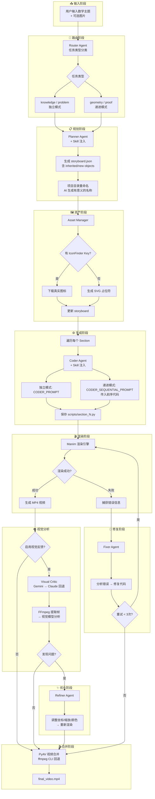

# MathVideo 系统架构详解

## 完整流程图 (Mermaid)



## 各阶段详细说明

### 0. 路由阶段 (Router)

> v1.1 新增

**输入**: 用户文本 + 图片描述（如有）

**处理**:
- 调用 Claude LLM (temperature=0.1)
- 使用 `ROUTER_PROMPT` 判断任务类型
- 容错解析：直接匹配 → JSON → 文本搜索 → 中文映射

**输出**: 任务类型 (`knowledge` / `geometry` / `problem` / `proof`)

**Section 模式决策**:
| 任务类型 | Section 模式 | 说明 |
|----------|-------------|------|
| `knowledge` | 独立 | 各节互不依赖 |
| `problem` | 独立 | 审题→建模→求解独立 |
| `geometry` | **递进** | 后节继承前节图形 |
| `proof` | **递进** | 逻辑链逐步推导 |

### 1. 规划阶段 (Planner)

**输入**: 数学主题字符串 + 任务类型 + Skill 注入

**处理**:
- 调用 Claude LLM
- 按任务类型选择 Prompt: `PLANNER_PROMPT` / `PLANNER_GEOMETRY_PROMPT` / `PLANNER_PROOF_PROMPT`
- 通过 SkillManager 加载经验技巧追加到 Prompt 末尾
- 生成结构化的 JSON 分镜脚本

**输出**: `storyboard.json`
```json
{
  "topic": "等边三角形中的对称与交点构造",
  "task_type": "geometry",
  "sections": [
    {
      "id": "section_1",
      "title": "构造等边三角形 ABC",
      "lecture_lines": ["等边三角形", "三边相等", "各角 60°"],
      "animations": ["三角形淡入", "边标注", "角标记"],
      "inherited_objects": [],
      "new_objects": ["triangle_ABC", "labels"]
    }
  ]
}
```

### 2. 项目重命名

> v1.1 新增

**触发**: Planner 生成 storyboard 后

**处理**: 用 storyboard 的 AI 生成 `topic` 字段重命名输出目录

**效果**: `已知等边三角形ABC-273bcf` → `等边三角形中的对称与交点构造-75bd10`

### 3. 资产阶段 (Asset Manager)

**输入**: storyboard.json

**处理**:
- 分析故事板内容
- 识别需要的图标关键词
- 尝试从 IconFinder 下载
- 失败时生成 SVG 占位符

**输出**: `assets/` 目录下的图标文件

### 4. 生成阶段 (Coder)

**输入**: 单个 section 数据 + (递进模式) 前序 Section 代码

**处理**:
- 调用 Claude LLM
- 按模式选择 Prompt: `CODER_PROMPT`（独立） / `CODER_SEQUENTIAL_PROMPT`（递进）
- 通过 SkillManager 注入经验技巧
- 生成继承自 `TeachingScene` 的 Manim 代码

**递进模式关键**: Coder 接收 `previous_code` + `inherited_objects` + `new_objects`，先 `self.add()` 静默重建继承对象，再动画展示新对象。

**输出**: `scripts/section_N.py`

### 5. 渲染阶段 (Manim)

**输入**: Python 脚本文件

**处理**:
- 调用 `manim -ql` 命令
- 设置 PYTHONPATH 确保导入正确
- 捕获渲染输出和错误

**输出**: MP4 视频文件 或 错误信息

### 6. 修复阶段 (Fixer)

**触发条件**: 渲染失败

**输入**: 原始代码 + 错误信息

**处理**:
- 调用 Claude LLM (temperature=0.2)
- 使用 `FIX_CODE_PROMPT` 模板
- 分析错误并生成修复代码

**输出**: 修复后的代码 (最多重试 3 次)

### 7. 视觉分析阶段 (Critic)

**触发条件**: 渲染成功 且 `USE_VISUAL_FEEDBACK=true`

**输入**: MP4 视频文件

**处理**:
1. FFmpeg 提取关键帧 (每秒1帧, 最多4帧)
2. Base64 编码图像
3. 发送到 Gemini 3 Pro（优先）/ Claude（回退）视觉模型
4. 分析布局、几何正确性、文字可读性

**输出**: JSON 反馈
```json
{
  "has_issues": true,
  "issues": ["直角标记位置错误", "标签与图形重叠"],
  "suggestion": "将直角标记移动到正确的顶点位置"
}
```

### 8. 优化阶段 (Refiner)

**触发条件**: Critic 发现问题

**输入**: 原始代码 + 视觉反馈建议

**处理**:
- 调用 Claude LLM (temperature=0.3)
- 使用 `REFINE_CODE_PROMPT` 模板
- 仅调整视觉参数,不改变逻辑

**输出**: 优化后的代码 → 重新渲染

### 9. 视频合并

> v1.1 新增

**触发条件**: 有 2 个以上分镜渲染成功

**处理**:
- 主方案: PyAV (Manim 内置依赖) concat demuxer + decode/encode
- 回退方案: CLI ffmpeg `-c copy`

**输出**: `final_video.mp4`

## Skill 注入系统

> v1.1 新增

### 工作原理

```
mathvideo/skills/
├── common/          ← 所有类型共用的最佳实践
├── geometry/        ← 几何构造专用技巧
├── knowledge/       ← 知识点讲解专用（待扩充）
├── problem/         ← 应用/计算题专用（待扩充）
└── proof/           ← 证明推导专用技巧
```

`load_skills("geometry")` → 加载 `common/` + `geometry/` 目录下所有 `.md` 文件 → 拼接为文本 → 追加到 Planner 和 Coder 的 Prompt 末尾。

**扩展方式**: 在对应目录下新建 `.md` 文件即可自动生效，无需修改代码。

## 关键技术点

### TeachingScene 网格系统

```
屏幕分割:
┌─────────────────┬──────────────────────────────────┐
│   左侧 (讲义)    │         右侧 (10×10 网格)          │
│                 │  A1  A2  A3  ...  A10            │
│  • 标题          │  B1  B2  B3  ...  B10            │
│  • 笔记 1        │  ...                             │
│  • 笔记 2        │  J1  J2  J3  ...  J10            │
│  • 笔记 3        │                                  │
└─────────────────┴──────────────────────────────────┘
```

### 定位方法

| 方法 | 用途 | 示例 |
|------|------|------|
| `place_at_grid` | 单点定位 | 小标签、点 |
| `place_in_area` | 区域定位 | 几何图形、组 |
| `add_side_label` | 边标签 | 三角形边 a, b, c |
| `add_vertex_label` | 顶点标签 | 顶点 A, B, C |
| `add_right_angle_mark` | 直角标记 | 直角三角形 |

### 防错机制

1. **LaTeX 回退**: 无 LaTeX 时自动使用 Text 替代 MathTex
2. **颜色别名**: 定义 CYAN, NAVY 等常见颜色防止 NameError
3. **文本智能缩放**: 只缩小过长文本,不拉伸短文本
4. **标签定位保护**: 辅助方法自动计算正确位置

## 前端架构

### Web 模式

```
浏览器 (:3000) ──rewrites──→ FastAPI (:8000)
    │                              │
    │  /api/*  ─────────────────→  /api/*
    │  /static/* ───────────────→  /static/* (output/)
    │
    └─ WebSocket ──────────────→  ws://localhost:8000/api/generate/ws/{task_id}
```

Next.js 14 App Router 全部使用 `'use client'` 渲染。`next.config.js` 通过 `rewrites` 将 API 和静态文件代理到后端。

### Tauri 桌面端模式

```
┌──────────────── Tauri (Rust) ────────────────┐
│                                              │
│  ┌──────────┐         ┌──────────────────┐   │
│  │ WebView  │ invoke  │  Tauri Commands   │   │
│  │ (Next.js)│────────→│  env_checker      │   │
│  │ :3000    │         │  backend_manager  │   │
│  └────┬─────┘         └────────┬─────────┘   │
│       │ HTTP/WS                │ subprocess   │
│       ▼                        ▼              │
│  FastAPI :8000    ← conda run -n mathvideo    │
└──────────────────────────────────────────────┘
```

Tauri 通过 Shell 插件管理 FastAPI 子进程。`next.config.js` 检测 `TAURI_ENV_PLATFORM` 环境变量切换 `output: 'standalone'` 模式（不启用 rewrites，前端直连 `:8000`）。

### 设计系统

CSS 变量驱动的语义化 Token 系统，支持明 (Notion 风) / 暗 (Apple 风) 双主题。组件层采用 shadcn/ui（CVA + Radix UI），动画层使用 framer-motion。详见 [FRONTEND.md](./FRONTEND.md)。

### 部署

支持 Tauri 桌面安装包 (.msi / .dmg)、Web 在线部署、CLI 脚本三种模式。GitHub Actions CI/CD 自动构建 Windows + macOS 多平台安装包。详见 [DEPLOYMENT.md](./DEPLOYMENT.md)。
