# MathVideo 系统架构详解

## 完整流程图 (Mermaid)

```mermaid
flowchart TB
    subgraph Input["📥 输入阶段"]
        A[用户输入数学主题<br/>例如: 勾股定理]
    end

    subgraph Planning["📋 规划阶段"]
        B[Planner Agent<br/>分镜规划器]
        B1[生成 storyboard.json<br/>包含章节、讲义、动画描述]
    end

    subgraph Assets["🖼️ 资产阶段"]
        C[Asset Manager<br/>资产管理器]
        C1{有 IconFinder<br/>API Key?}
        C2[下载真实图标]
        C3[生成 SVG 占位符]
        C4[更新 storyboard<br/>添加资产路径]
    end

    subgraph Generation["⚙️ 生成阶段"]
        D[遍历每个 Section]
        E[Coder Agent<br/>代码生成器]
        E1[生成 Manim Python 代码]
        E2[保存到 scripts/section_N.py]
    end

    subgraph Rendering["🎬 渲染阶段"]
        F[Manim 渲染引擎]
        F1{渲染成功?}
        F2[生成 MP4 视频]
        F3[捕获错误信息]
    end

    subgraph Fixing["🔧 修复阶段"]
        G[Fixer Agent<br/>错误修复器]
        G1[分析错误信息]
        G2[生成修复后的代码]
        G3{重试次数<br/>< 4?}
    end

    subgraph Critique["👁️ 视觉分析阶段"]
        H{启用视觉反馈?}
        H1[Visual Critic<br/>视觉批评家]
        H2[FFmpeg 提取关键帧<br/>每秒1帧, 最多4帧]
        H3[发送到 Gemini 3 Pro<br/>视觉大模型]
        H4[分析布局、几何正确性]
        H5{发现问题?}
    end

    subgraph Refining["✨ 优化阶段"]
        I[Refiner Agent<br/>代码优化器]
        I1[根据视觉反馈修改代码]
        I2[调整坐标、缩放、颜色]
        I3[重新渲染]
    end

    subgraph Output["📤 输出阶段"]
        J[最终视频文件]
        J1[output/主题/media/videos/]
    end

    %% 主流程连接
    A --> B
    B --> B1
    B1 --> C
    C --> C1
    C1 -->|是| C2
    C1 -->|否| C3
    C2 --> C4
    C3 --> C4
    C4 --> D

    D --> E
    E --> E1
    E1 --> E2
    E2 --> F
    F --> F1

    F1 -->|成功| F2
    F1 -->|失败| F3

    F3 --> G
    G --> G1
    G1 --> G2
    G2 --> G3
    G3 -->|是| F
    G3 -->|否| J1

    F2 --> H
    H -->|否| J
    H -->|是| H1
    H1 --> H2
    H2 --> H3
    H3 --> H4
    H4 --> H5

    H5 -->|否| J
    H5 -->|是| I
    I --> I1
    I1 --> I2
    I2 --> I3
    I3 --> J

    J --> J1

    %% 样式
    classDef input fill:#e1f5fe,stroke:#01579b
    classDef planning fill:#f3e5f5,stroke:#4a148c
    classDef assets fill:#fff3e0,stroke:#e65100
    classDef generation fill:#e8f5e9,stroke:#1b5e20
    classDef rendering fill:#fce4ec,stroke:#880e4f
    classDef fixing fill:#fff8e1,stroke:#f57f17
    classDef critique fill:#e3f2fd,stroke:#0d47a1
    classDef refining fill:#f1f8e9,stroke:#33691e
    classDef output fill:#e0f2f1,stroke:#004d40

    class A input
    class B,B1 planning
    class C,C1,C2,C3,C4 assets
    class D,E,E1,E2 generation
    class F,F1,F2,F3 rendering
    class G,G1,G2,G3 fixing
    class H,H1,H2,H3,H4,H5 critique
    class I,I1,I2,I3 refining
    class J,J1 output
```



## 各阶段详细说明

### 1. 规划阶段 (Planner)

**输入**: 数学主题字符串 (如 "勾股定理")

**处理**:
- 调用 Claude LLM
- 使用 `PLANNER_PROMPT` 模板
- 生成结构化的 JSON 分镜脚本

**输出**: `storyboard.json`
```json
{
  "topic": "勾股定理",
  "sections": [
    {
      "id": "section_1",
      "title": "直角三角形登场",
      "lecture_lines": ["直角三角形", "三边命名", "直角 90°"],
      "animations": ["三角形淡入", "边闪烁标注", "直角标记"]
    }
  ]
}
```

### 2. 资产阶段 (Asset Manager)

**输入**: storyboard.json

**处理**:
- 分析故事板内容
- 识别需要的图标关键词
- 尝试从 IconFinder 下载
- 失败时生成 SVG 占位符

**输出**: `assets/` 目录下的图标文件

### 3. 生成阶段 (Coder)

**输入**: 单个 section 数据

**处理**:
- 调用 Claude LLM
- 使用 `CODER_PROMPT` 模板
- 生成继承自 `TeachingScene` 的 Manim 代码

**输出**: `scripts/section_N.py`

### 4. 渲染阶段 (Manim)

**输入**: Python 脚本文件

**处理**:
- 调用 `manim -ql` 命令
- 设置 PYTHONPATH 确保导入正确
- 捕获渲染输出和错误

**输出**: MP4 视频文件 或 错误信息

### 5. 修复阶段 (Fixer)

**触发条件**: 渲染失败

**输入**: 原始代码 + 错误信息

**处理**:
- 调用 Claude LLM
- 使用 `FIX_CODE_PROMPT` 模板
- 分析错误并生成修复代码

**输出**: 修复后的代码 (最多重试 4 次)

### 6. 视觉分析阶段 (Critic)

**触发条件**: 渲染成功 且 `USE_VISUAL_FEEDBACK=True`

**输入**: MP4 视频文件

**处理**:
1. FFmpeg 提取关键帧 (每秒1帧, 最多4帧)
2. Base64 编码图像
3. 发送到 Gemini 3 Pro 视觉模型
4. 分析布局、几何正确性、文字可读性

**输出**: JSON 反馈
```json
{
  "has_issues": true,
  "issues": ["直角标记位置错误", "标签与图形重叠"],
  "suggestion": "将直角标记移动到正确的顶点位置"
}
```

### 7. 优化阶段 (Refiner)

**触发条件**: Critic 发现问题

**输入**: 原始代码 + 视觉反馈建议

**处理**:
- 调用 Claude LLM
- 使用 `REFINE_CODE_PROMPT` 模板
- 仅调整视觉参数,不改变逻辑

**输出**: 优化后的代码 → 重新渲染

## 关键技术点

### TeachingScene 网格系统

```
屏幕分割:
┌─────────────────┬──────────────────────────────────┐
│   左侧 (讲义)    │         右侧 (10x10 网格)          │
│                 │  A1  A2  A3  ...  A10            │
│  • 标题          │  B1  B2  B3  ...  B10            │
│  • 笔记 1        │  ...                             │
│  • 笔记 2        │  J1  J2  J3  ...  J10            │
│  • 笔记 3        │                                  │
└─────────────────┴──────────────────────────────────┘
```

### 定位方法

| 方法 | 用途 | 示例 |
|------|------|------|
| `place_at_grid` | 单点定位 | 小标签、点 |
| `place_in_area` | 区域定位 | 几何图形、组 |
| `add_side_label` | 边标签 | 三角形边 a, b, c |
| `add_vertex_label` | 顶点标签 | 顶点 A, B, C |
| `add_right_angle_mark` | 直角标记 | 直角三角形 |

### 防错机制

1. **LaTeX 回退**: 无 LaTeX 时自动使用 Text 替代 MathTex
2. **颜色别名**: 定义 CYAN, NAVY 等常见颜色防止 NameError
3. **文本智能缩放**: 只缩小过长文本,不拉伸短文本
4. **标签定位保护**: 辅助方法自动计算正确位置
